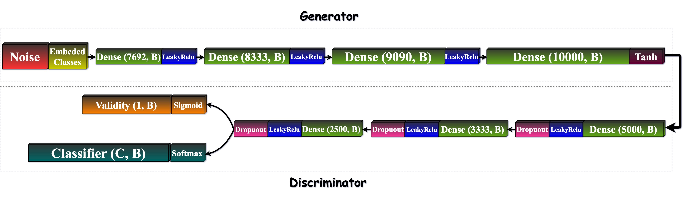

# Genome-AC-GAN: Genotype With Auxiliary Classifier GANs

This Git repository contains an implementation of the article titled "Genome-AC-GAN: Genotype With Auxiliary Classifier
GANs." The repository provides tools and code to train the Genome-AC-GAN model with various configurations and conduct
evaluations and comparisons with other models.

The Genome-AC-GAN is a model introduced in the article, which focuses on generating artificial human genomes using
generative models. This repository aims to provide an implementation of the Genome-AC-GAN model, allowing users to train
the model with different configurations and conduct various evaluations.

Preview models and some compression analysis functions based on the project:
https://gitlab.inria.fr/ml_genetics/public/artificial_genomes/-/tree/master/GAN_AGs

This repository implement the articles:

"Deep convolutional and conditional neural networks for large-scale genomic data generation"

"Creating Artificial Human Genomes Using Generative Model"

### Installation

To use this repository, please follow these steps:

Clone the repository to your local machine:
Copy code
`git clone https://github.com/Shaked35/cGenome-AC-GAN`

create venv with python 3.9 and install [requirements.txt](assets/requirements.txt)
you can run make setup or make install from the terminal inside the project to prepare your python virtual environment.

Usage
Once you have completed the installation process, you can start using the Genome-AC-GAN implementation. Here are the
general steps to follow:

*Prepare your dataset*: the dataset should be ready in the resource directory.
before each training you'll do the preprocessing step.

*Train the model*: Use the provided training script [train_with_configuration.py](train_with_configuration.py) to train 
the Genome-AC-GAN model based on yaml configuration. you can use one of the existing 
configurations [configurations](configurations) that used in our paper.
if you want to train your own model, create a new yaml configuration based on the [arguments_description.yaml](configurations%2Farguments_description.yaml) and run the same script with --path <your_configuration_path.yaml>

you can follow the steps below and training the new model or the old model. you also can find the input arguments that will affect the final model.

*Perform evaluations*: After training the model, you can conduct various evaluations to assess its performance. This may
include evaluating metrics such as sequence similarity, diversity, or other domain-specific measurements.

you can find different evaluations below in different jupyther notebooks.

### Synthetic Genotypes Sequences (Output Models Results)

- [Genome-AC-GAN By Continental Population genotypes.hapt](resource%2FGenome-AC-GAN%20By%20Continental%20Population%20genotypes.hapt)
  Genome-AC-GAN trained by Continental Population (Superpopulation code)
- [Genome-AC-GAN By National Population genotypes.hapt](resource%2FGenome-AC-GAN%20By%20National%20Population%20genotypes.hapt)
  Genome-AC-GAN trained by National Population (Population code)
- [10K_SNP_GAN_AG_10800Epochs.hapt](fake_genotypes_sequences%2Fpreview_sequences%2F10K_SNP_GAN_AG_10800Epochs.hapt) new
  RMB genotypes from the article: "Deep convolutional and conditional neural networks for large-scale genomic data
  generation"
- [10K_WGAN.hapt](fake_genotypes_sequences%2Fpreview_sequences%2F10K_WGAN.hapt)new WGAN genotypes from the article: "
  Deep convolutional and conditional neural networks for large-scale genomic data generation"
- [10K_RBM.hapt](fake_genotypes_sequences%2Fpreview_sequences%2F10K_RBM.hapt) old RMB genotypes from the article: "
  Creating Artificial Human Genomes Using Generative Model"
- [old GAN retrain genotypes.hapt](fake_genotypes_sequences%2Fpreview_sequences%2Fold%20GAN%20retrain%20genotypes.hapt)
  old GAN model that retrain on our [train_0.8_super_pop.csv](resource%2Ftrain_0.8_super_pop.csv) that contains 80% of
  the data from the article: "Creating Artificial Human Genomes Using Generative Model"

### Comparisons and Evaluations

To further evaluate the performance of the Genome-AC-GAN model, this repository enables comparisons with other models
from the article "Creating Artificial Human Genomes Using Generative Models" and the paper "Deep convolutional and
conditional neural networks for large-scale genomic data generation." You can refer to the corresponding papers for more
information on these models.

- [compare_models_analysis.py.ipynb](analysis%2Fcompare_models_analysis.py.ipynb): use old and new evaluation test to
  analysis and compare between different models
- [population_analysis.ipynb](analysis%2Fpopulation_analysis.ipynb): analysis population models with different
  evaluation tests like PCA and allele frequency (Continental population and National population)
- [split_real_data.ipynb](analysis%2Fsplit_real_data.ipynb): split real data to train and test
- [train_classifier_with_synthetic.ipynb](analysis%2Ftrain_classifier_with_synthetic.ipynb): train different
  classification models with different amount of synthetic data
- [classifier_analysis.ipynb](analysis%2Fclassifier_analysis.ipynb): analysis types of different types of loss function

### Contributing

Contributions to this repository are welcome. If you find any issues or have suggestions for improvements, please feel
free to open an issue or submit a pull request.

### Genome-AC-GAN Architecture

### PCA Compression

### PCA Of Continental Population Training

### Classifier Models Improvements With Synthetic Augmentations

### Training Models

In addition to the Genome-AC-GAN model, this repository also provides an implementation of the model described in the
article "Creating Artificial Human Genomes Using Generative Models." You can find the details and instructions for
training the old model in the artificial_genomes repository.

- [old_model_training.py](old_model_training.py): train old model based
  on https://gitlab.inria.fr/ml_genetics/public/artificial_genomes/-/blob/master/GAN_prev/gan_script5.py
- [train_with_configuration.py](train_with_configuration.py): training Genome-AC-GAN model based on input --path config
- [genome_ac_gan_training.py](genome_ac_gan_training.py): train new types of models with cli arguments

